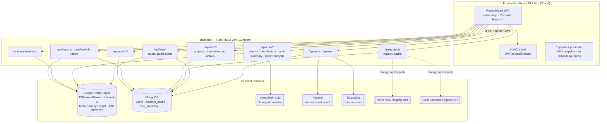
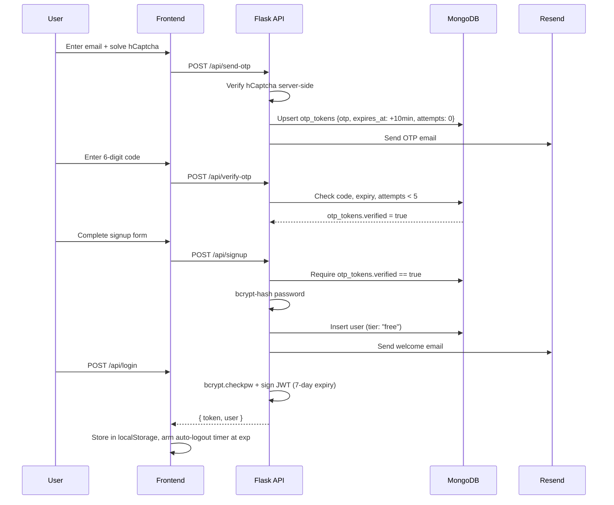
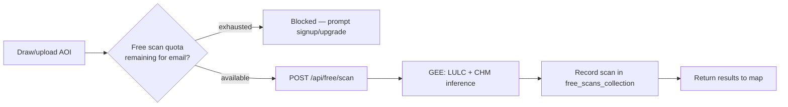
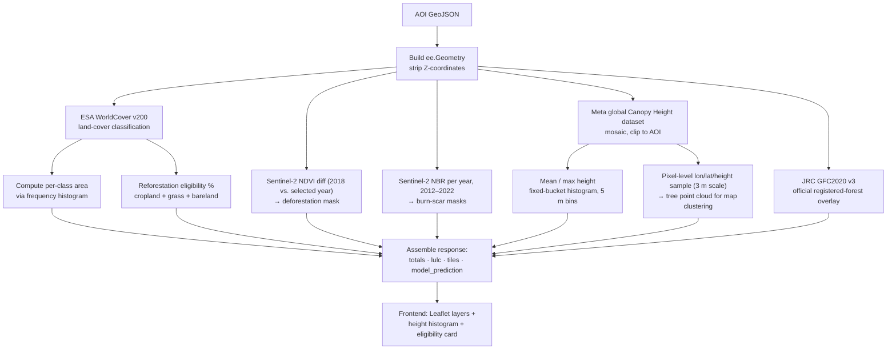
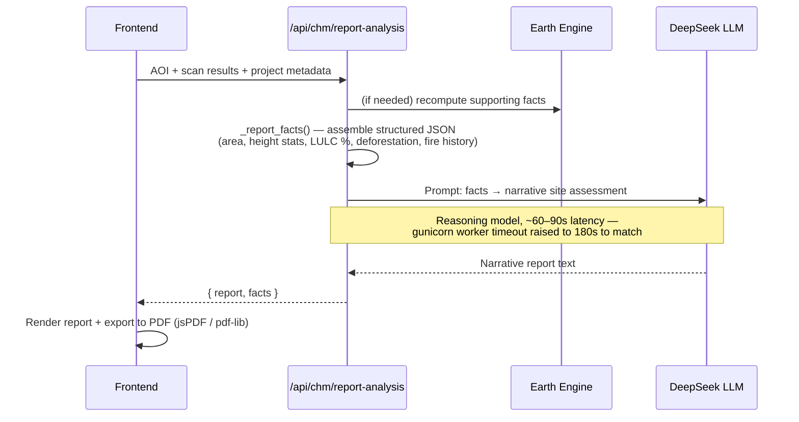
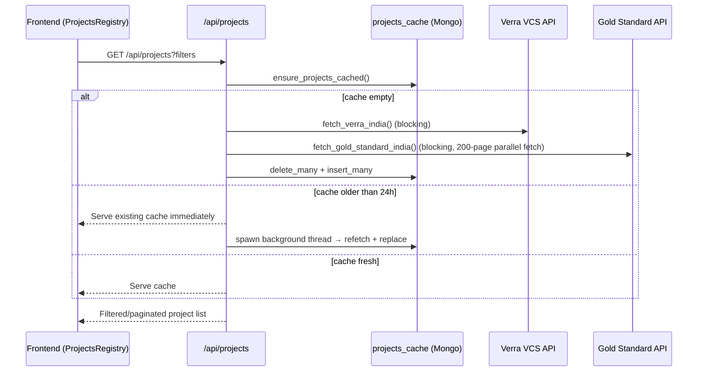
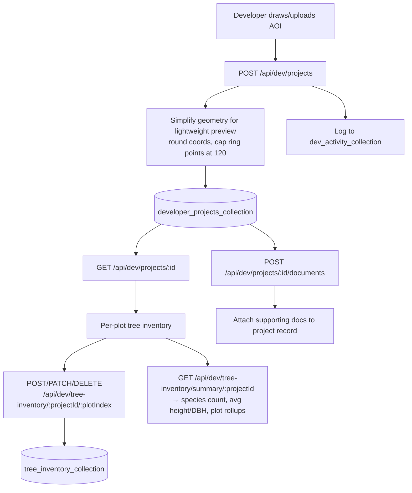

# Sylithe v2

**Satellite-powered dMRV for forest carbon.** Sylithe turns a drawn or uploaded land boundary into a full digital Monitoring, Reporting & Verification (dMRV) package — canopy height, land-cover classification, deforestation/fire history, official forest overlays, and AI-narrated reports — computed on demand from open Earth-observation data, with no field survey required to get a first read.

<p align="left">
  
  
  
  
</p>

---

## Table of Contents

- [What Sylithe Does](#what-sylithe-does)
- [System Architecture](#system-architecture)
- [Monorepo Layout](#monorepo-layout)
- [Tech Stack](#tech-stack)
- [Core Flows](#core-flows)
  - [1. Authentication & Onboarding](#1-authentication--onboarding)
  - [2. Free-Tier Land Scan](#2-free-tier-land-scan)
  - [3. Canopy Height Model (CHM) Pipeline](#3-canopy-height-model-chm-pipeline)
  - [4. Land History & AI Report Generation](#4-land-history--ai-report-generation)
  - [5. Carbon Project Registry Aggregation](#5-carbon-project-registry-aggregation)
  - [6. Developer Project & Tree Inventory Workspace](#6-developer-project--tree-inventory-workspace)
  - [7. Admin Console](#7-admin-console)
- [Data Model](#data-model)
- [API Reference](#api-reference)
- [Frontend Route Map](#frontend-route-map)
- [Access Tiers](#access-tiers)
- [Getting Started](#getting-started)
- [Environment Variables](#environment-variables)
- [Deployment](#deployment)
- [Security Notes](#security-notes)

---

## What Sylithe Does

A user (landowner, carbon project developer, corporate buyer, investor, or government body) draws or uploads an Area of Interest (AOI) on an interactive map. Sylithe fans that AOI out to Google Earth Engine and, in a single request, returns:

- **Canopy Height Model (CHM)** — per-pixel tree height from Meta's high-resolution global canopy height dataset, bucketed into a height-distribution histogram and clustered tree points for map rendering.
- **Land-cover classification** — ESA WorldCover breakdown (forest, cropland, grassland, bareland, water, mangroves, urban, ice/snow) with per-class hectare totals and map tile overlays.
- **Change detection** — deforestation (NDVI drop 2018 → present) and burn-scar history (NBR-based, year-by-year 2012–2022) from Sentinel-2 imagery.
- **Official forest overlay** — JRC Global Forest Cover 2020 (v3), the authoritative layer used for EUDR-aligned reporting.
- **Reforestation/afforestation eligibility** — percentage of the AOI classified as non-forest land suitable for a nature-based project.
- **AI-narrated report** — the computed facts are handed to a reasoning LLM (DeepSeek) which writes a plain-English site assessment, rendered to a shareable PDF.

Around that geospatial core sits a full product: authenticated accounts with tiered access, a live carbon-credit registry explorer (Verra VCS + Gold Standard, India-scoped), a project-developer workspace with plot-level tree inventory and document management, QR-code-linked public tree profiles, and an admin console.

---

## System Architecture



**Design principles baked into the architecture:**
- **Stateless compute, cached truth.** Nothing about a satellite scene is stored — every CHM/LULC/deforestation figure is recomputed live from Earth Engine on each request. The only things persisted are *user-generated* state (accounts, drawn projects, tree records) and a TTL-refreshed cache of third-party registry data.
- **Background warm-up, synchronous fallback.** Earth Engine credentials are initialized on a daemon thread at process start so cold starts don't block routing; each request path re-probes and self-heals (`_ensure_gee()`) if the race was lost.
- **Tier-gated by design, not by hiding routes.** Free-tier usage is metered server-side (`free_scans_collection`, `feature_usage_collection`) — the frontend blur/paywall is UX, the quota check is the actual gate.

---

## Monorepo Layout

```
sylithe-v2/
├── backend/                    Python Flask REST API
│   ├── app.py                  Blueprint registration, health check
│   ├── config.py                Env-driven settings, CORS allow-list, registry color map
│   ├── db.py                    MongoDB client, collections, indexes
│   ├── gunicorn.conf.py         180s worker timeout (AI report generation is slow)
│   ├── routes/
│   │   ├── auth.py              Signup, OTP, login, password reset
│   │   ├── chm.py               CHM inference, land history/summary, AI report facts
│   │   ├── analytics.py         Ad-hoc GEE analytics endpoint
│   │   ├── free_tier.py         Quota-gated free scan
│   │   ├── projects.py          Carbon registry read API
│   │   ├── developer_projects.py Project CRUD, activity log, documents
│   │   ├── tree_inventory.py    Per-plot tree CRUD + summary stats
│   │   ├── reports.py           LULC PDF report generation + usage metering
│   │   ├── admin.py             Admin stats, user/project/access-request management
│   │   └── newsletter.py        Newsletter signup
│   ├── services/
│   │   ├── gee_init.py          Shared Earth Engine credential bootstrap
│   │   ├── registry.py          Verra + Gold Standard fetch/cache/geocode
│   │   └── email.py             Resend-backed transactional email templates
│   └── utils/auth.py            require_auth / require_admin JWT decorators
│
└── frontend/                    React 19 + Vite + Tailwind SPA
    ├── src/
    │   ├── App.jsx               Router, lazy-loaded pages, auth-gated routes, layout
    │   ├── context/AuthContext.jsx  JWT lifecycle: login, auto-expiry logout, /me sync
    │   ├── pages/
    │   │   ├── dashboards/       Corporate / Investor / Developer / Government / ProjectDevHub
    │   │   ├── solutions/methodology/  LULC, CHM, DCAB, AGB explainer pages
    │   │   ├── admin/            Admin panel
    │   │   └── insights/         Blog engine
    │   ├── components/chm/       Leaflet map, drawing tools, layer sidebar, PDF export
    │   └── services/             Typed fetch wrappers (chmApi, devProjectsApi, freeScanApi, PDF generators)
    ├── prerender.js               Puppeteer static-snapshot generator for SEO
    └── scripts/                   Sitemap + IndexNow generation
```

---

## Tech Stack

| Layer | Technology |
|---|---|
| Frontend framework | React 19, Vite 7, React Router 7 |
| Styling / UI | Tailwind CSS, Radix UI primitives, Framer Motion, Lucide icons |
| Mapping | Leaflet, react-leaflet, leaflet-draw, georaster-layer-for-leaflet |
| Geo file parsing | `@tmcw/togeojson` (KML), `shpjs` (Shapefile) |
| Charts / PDF | Recharts, jsPDF, pdf-lib, html2pdf.js, QRCode |
| SEO | react-helmet-async, Puppeteer prerendering, generated sitemap + IndexNow ping |
| Backend framework | Python 3, Flask, Flask-CORS, Gunicorn |
| Database | MongoDB (PyMongo) |
| Auth | JWT (PyJWT), bcrypt password hashing, hCaptcha bot protection |
| Geospatial engine | Google Earth Engine (`earthengine-api`) |
| AI | DeepSeek (reasoning model) for narrative report generation |
| Email | Resend |
| Hosting | Frontend → Vercel · Backend → any WSGI host (Gunicorn) |

---

## Core Flows

### 1. Authentication & Onboarding

Email identity is verified with an OTP *before* an account can be created — the password is never trusted without a confirmed inbox.



Session handling on the frontend (`AuthContext.jsx`) decodes the JWT client-side to schedule automatic logout precisely at expiry, and silently re-syncs the user's profile (tier, name) from `/api/me` on every mount — so a tier upgrade made in the admin console takes effect on the user's next page load without a manual re-login.

### 2. Free-Tier Land Scan

The zero-signup-friction entry point: a visitor draws an AOI and gets an instant, rate-limited canopy/land-cover snapshot.



### 3. Canopy Height Model (CHM) Pipeline

The computational core, `run_chm_inference()`, runs entirely server-side against Earth Engine and returns a self-contained payload of stats, histograms, tree points, and pre-rendered map tile URLs:



Each Earth Engine call is individually wrapped in `try/except` — a failed burn-year or a missing CHM tile degrades that one panel to zero/empty rather than failing the whole request, since a single flaky year of Sentinel-2 coverage shouldn't take down the entire report.

### 4. Land History & AI Report Generation

`land-history` and `land-summary` extend the same GEE primitives across a time series; `report-analysis` is where computed geospatial facts become a written report:



### 5. Carbon Project Registry Aggregation

`/api/projects` never calls Verra or Gold Standard directly on the request path — it serves a MongoDB-cached, India-scoped snapshot and refreshes it lazily in the background:



State/city names are extracted from free-text project names and proponent fields (`extract_indian_state()`) against a 60+ entry gazetteer to plot projects on the map even when the source registry omits coordinates.

### 6. Developer Project & Tree Inventory Workspace

Project developers get a persistent workspace (`/dashboard/project-hub`) distinct from the ephemeral free scan: drawn AOIs are saved as first-class projects, geometry is simplified for storage/preview, and each project can carry a plot-indexed tree inventory plus supporting documents.



Each tree record can be linked to a QR code (`qrcode` on the frontend) that resolves to the public, unauthenticated `/tree` route (`TreeProfile.jsx`) — a field-scannable public profile per tree, independent of the authenticated dashboard.

### 7. Admin Console

`require_admin` gates everything under `/api/admin/*` by checking the JWT's email against `ADMIN_EMAILS` — a static allow-list, not a database role field. The console surfaces:

- Platform-wide stats (`/admin/stats`) — users, projects, scan volume.
- User management with tier overrides (`/admin/users/:id` PATCH — this is how a `free` user becomes `pro`, which the frontend's `AuthContext` `/me` sync then picks up on the user's next visit).
- Access-request review queue (`/admin/access-requests`) for users requesting elevated tier access.
- Scan and newsletter subscriber views for growth/ops visibility.

---

## Data Model

MongoDB database `sylithe`, with indexes created idempotently at startup (`db.py`):

| Collection | Purpose | Key Indexes |
|---|---|---|
| `users` | Account records, bcrypt password hash, `tier` (free/pro) | `email` (unique) |
| `otp_tokens` | Short-lived signup/reset OTP codes | `email` |
| `newsletter` | Newsletter subscribers | — |
| `projects_cache` | TTL-cached Verra/Gold Standard registry entries | `country+registry`, `country+state`, `country+status`, `name` |
| `free_scans` | Free-tier scan usage log, for quota enforcement | `email+created_at` |
| `access_requests` | User requests for elevated access, admin-reviewed | `user_email`, `status`, `requested_at` |
| `developer_projects` | Saved developer-drawn projects (simplified geometry, docs) | `developer_email+created_at` |
| `dev_activity` | Audit trail of developer project actions | `developer_email+timestamp` |
| `tree_inventory` | Per-plot tree records (species, height, DBH, QR link) | `developer_email+project_id+plot_index` |
| `lulc_reports` | Generated LULC PDF report metadata | `email+created_at` |
| `feature_usage` | Generic per-user feature usage metering | `email+action` |

---

## API Reference

All routes are mounted under `/api` (see `app.py` for exact prefixes). JWT auth via `Authorization: Bearer <token>`; `@require_auth` / `@require_admin` decorators in `utils/auth.py`.

| Prefix | Module | Auth | Description |
|---|---|---|---|
| `/api/send-otp`, `/verify-otp`, `/signup`, `/login`, `/forgot-password`, `/verify-reset-otp`, `/reset-password`, `/me` | `routes/auth.py` | Public / `@require_auth` for `/me` | Full signup-via-OTP, login, and password-reset lifecycle |
| `/api/gee/analytics` | `routes/analytics.py` | Public | Ad-hoc Earth Engine analytics for an AOI |
| `/api/chm/predict`, `/land-history`, `/land-summary`, `/report-analysis` | `routes/chm.py` | Public / tier-gated on frontend | CHM inference, historical trends, AI-narrated report |
| `/api/free/scan` | `routes/free_tier.py` | Quota-gated | Free-tier AOI scan |
| `/api/free/lulc-report`, `/lulc-report/quota`, `/usage`, `/usage/consume` | `routes/reports.py` | Quota-gated | PDF LULC report generation + usage metering |
| `/api/projects`, `/projects/refresh`, `/projects/:id` | `routes/projects.py` | Public | Carbon registry browse/detail/manual refresh |
| `/api/dev/projects`, `/dev/projects/:id`, `/dev/stats`, `/dev/activity`, `/dev/projects/:id/documents` | `routes/developer_projects.py` | `@require_auth` | Developer project CRUD, stats, activity, documents |
| `/api/dev/tree-inventory/:projectId/:plotIndex`, `/dev/tree-inventory/:oid`, `/dev/tree-inventory/summary/:projectId` | `routes/tree_inventory.py` | `@require_auth` | Plot-level tree CRUD and rollup stats |
| `/api/request-access` | `routes/admin.py` | Public (submission) | User submits an access-tier upgrade request |
| `/api/admin/stats`, `/admin/projects`, `/admin/users`, `/admin/access-requests`, `/admin/scans`, `/admin/newsletter` | `routes/admin.py` | `@require_admin` | Platform administration |
| `/api/newsletter` | `routes/newsletter.py` | Public | Newsletter subscription |
| `/health` | `app.py` | Public | Liveness check |

---

## Frontend Route Map

| Route | Access | Notes |
|---|---|---|
| `/`, `/about`, `/platform`, `/what-we-offer`, `/for-buyers`, `/insights`, `/insights/:slug` | Public | Marketing site, prerendered for SEO |
| `/methodology/lulc`, `/methodology/chm`, `/methodology/dcab`, `/methodology/agb` | Public | Methodology explainer pages |
| `/tree` | Public | QR-scannable public tree profile — no auth |
| `/signup`, `/login` | Public | Auth flows |
| `/projects` | Authenticated | Carbon project registry explorer |
| `/dashboard`, `/chm-verification`, `/dashboard/corporate`, `/dashboard/investor`, `/dashboard/government` | Authenticated + **Pro tier** | Blurred + paywalled for `free` tier |
| `/dashboard/developer`, `/dashboard/project-hub` | Authenticated | Available to free tier — project developer workspace |
| `/admin` | Authenticated (admin allow-list, enforced server-side) | Admin console |

`PrivateRoute` in `App.jsx` handles the pro-tier paywall client-side (blurred content + upgrade CTA), while the server independently enforces auth/admin on every write — the frontend gate is UX, not the security boundary.

---

## Access Tiers

| Tier | Granted | Gate |
|---|---|---|
| **Anonymous** | Free scan (quota-limited), registry browsing, methodology pages, public tree profiles | IP/email-based quota in `free_scans_collection` |
| **Free (signed up)** | Everything anonymous gets, plus project-developer workspace, tree inventory, saved projects | `users.tier == "free"` |
| **Pro** | Full dashboards (corporate, investor, government), unrestricted CHM verification | `users.tier == "pro"`, granted via admin console or `/api/request-access` review |
| **Admin** | Platform administration, tier overrides, access-request approval | Email present in `ADMIN_EMAILS` |

---

## Getting Started

### Backend

```bash
cd backend
python -m venv venv
source venv/bin/activate        # Windows: venv\Scripts\activate
pip install -r requirements.txt
cp .env.example .env            # fill in your values — see below
python app.py                   # http://localhost:5001
```

### Frontend

```bash
cd frontend
npm install
npm run dev                     # http://localhost:5173
npm run build                   # sitemap generation → vite build → SEO prerender
```

Set `VITE_API_URL` in the frontend environment to point at the backend (defaults to same-origin).

---

## Environment Variables

Backend (`backend/.env`):

| Variable | Description |
|---|---|
| `MONGO_URI` | MongoDB connection string |
| `JWT_SECRET` | Secret key for signing JWTs — required, process refuses to start without it |
| `RESEND_API_KEY` | [Resend](https://resend.com) API key for transactional email |
| `HCAPTCHA_SECRET` | hCaptcha server-side secret |
| `DEEPSEEK_API_KEY` | DeepSeek API key for AI-narrated reports |
| `ADMIN_EMAILS` | Comma-separated admin email allow-list |
| `GEE_SERVICE_ACCOUNT_JSON` / `GEE_SERVICE_ACCOUNT_PATH` | Earth Engine service-account credentials — JSON string (hosted platforms) or file path (local) |

See [`backend/README_GEE_SETUP.md`](backend/README_GEE_SETUP.md) for full Earth Engine service-account setup.

---

## Deployment

- **Frontend** — Vercel. `vercel.json` handles the `www` → apex redirect, SPA rewrite, and SEO headers (`noindex` on `/dashboard/*`). Build step runs sitemap generation and a Puppeteer prerender pass so crawlers see fully-rendered marketing/blog pages.
- **Backend** — any WSGI host behind Gunicorn (`gunicorn.conf.py`). Worker timeout is deliberately raised to 180s to accommodate the DeepSeek reasoning model's ~60–90s report-generation latency, which would otherwise be killed by Gunicorn's 30s default.

---

## Security Notes

- Passwords are bcrypt-hashed; raw passwords are never persisted or logged.
- Signup requires a verified OTP — an account cannot be created against an email the user doesn't control.
- JWTs are HS256-signed, 7-day expiry; the frontend enforces client-side auto-logout at expiry as defense-in-depth, but every protected route re-validates the token server-side.
- Admin access is a static email allow-list checked on every request (`require_admin`), not a client-trusted role claim.
- hCaptcha is verified server-side (never trusting a client-supplied "solved" flag) before an OTP is issued.

---

## License

Private — all rights reserved.
